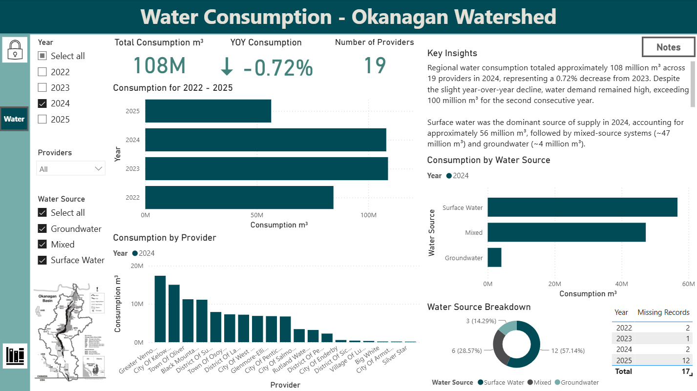
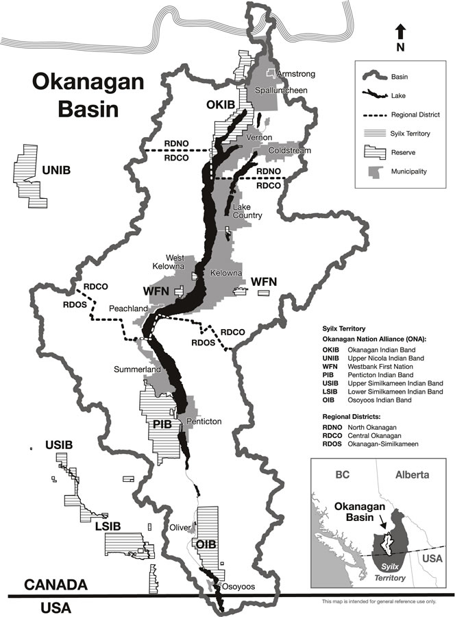

# TOTA Water Consumption Power BI Dashboard

## Project Overview

During my summer student role with the Thompson Okanagan Tourism Association (TOTA) on the Destination Stewardship team, I developed this Power BI dashboard to analyze municipal water consumption across the Okanagan watershed. The project involved collecting and standardizing water consumption data from multiple municipalities and public sources, developing analytical measures in DAX, and transforming the data into an interactive dashboard.

The project was developed to support TOTA's broader work in regional sustainability reporting, including its participation in the [UN Tourism International Network of Sustainable Tourism Observatories (INSTO).](https://www.untourism.int/observatories/thompson-okanagan)

This project demonstrates my experience applying data analysis, data management, visualization, and business intelligence tools to a real-world sustainability and tourism context.

The dashboard allows users to explore:

* Total municipal water consumption by year
* Water consumption trends over time
* Consumption by water source
* Compare municipal water providers
* Year-over-year changes in consumption
* Regional patterns in municipal water use

## Key Skills Demonstrated

**Data Analysis & Visualization**

* Power BI
* DAX
* Data modelling
* Interactive dashboard design
* KPI development
* Trend analysis
* Geographic and regional analysis

**Data Management**

* Data collection from multiple public sources
* Data cleaning and standardization
* Handling missing values
* Data validation
* Structuring datasets for repeatable analysis
* Documentation of data sources and methodology

**Analytical Thinking**

* Translating a broad sustainability question into measurable indicators
* Developing metrics that support year-over-year comparison
* Identifying limitations and gaps in publicly available data
* Designing visualizations for both technical and non-technical audiences

## Dashboard

The dashboard is designed to allow users to move from a high-level regional overview into more detailed comparisons of municipalities, years, and water sources.

### Core Analysis

The dashboard focuses on two primary indicators:

**Regional Annual Municipal Water Consumption**

Measures the total volume of municipal water consumed within the study region for a given year.

**Annual Municipal Water Consumption Growth Rate**

Measures the percentage change in municipal water consumption between years:

`((Current Year - Previous Year) / Previous Year) × 100`

These indicators provide both an absolute measure of water use and a way to identify changes in consumption over time.

## Methodology & Data

.

## Geographic Scope

The project focuses on the **Okanagan watershed pilot region** rather than the entire Thompson Okanagan tourism region.

The Okanagan watershed is particularly relevant to the analysis because water resources support communities, agriculture, ecosystems, and tourism throughout the region.

## Project Outcomes

This project demonstrates how publicly available environmental data can be transformed into a practical analytical product.

Rather than simply presenting individual datasets, the project establishes a workflow for:

* Bringing together fragmented data sources
* Creating a standardized regional dataset
* Developing reproducible indicators
* Communicating uncertainty and data limitations
* Building interactive reporting for decision-makers
* Supporting longer-term sustainability monitoring

The resulting dashboard provides a foundation that can be expanded for future INSTO reporting.

## Contact
alexisdsamp@gmail.com

This project was developed by **Alexis Samp** as part of a INSTO reporting initiative with the **Thompson Okanagan Tourism Association (TOTA)**.

---
